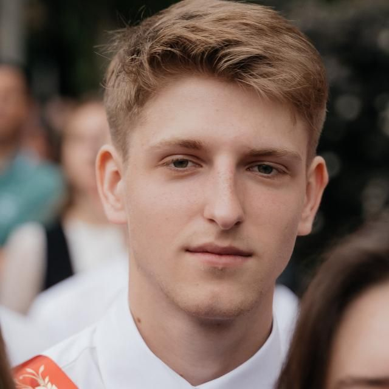

<table>
<tr>
<td>

# Владислав Сорокин

**Резюме на позицию стажёра Backend-разработчика (Go)**

📧 Email: vladik2801@gmail.com  
💬 Telegram: @ITmachine_fullstack  
💻 GitHub: https://github.com/vladik2801  

</td>

<td>

</td>
</tr>
</table>

---

## О себе

Студент 2 курса университета ИТМО, обучаюсь по направлению «Разработка программного обеспечения».

Интересуюсь backend-разработкой и инфраструктурными технологиями. В настоящее время изучаю язык Go и инструменты backend-разработки.

Стремлюсь развиваться в области серверной разработки, углублять знания в системном программировании и получать практический опыт разработки. Рассматриваю стажировку как возможность применить полученные знания на практике и попасть в команду Selectel.

---

## Образование

**Университет ИТМО**  
Бакалавриат, направление **«Разработка программного обеспечения (Software Engineering)»**  
2024 — настоящее время  

В рамках обучения получил базовые знания **алгоритмов и структур данных**, а также **объектно-ориентированного программирования**. Имею опыт разработки на C++, C#, Python и работы с базами данных.

### Основные дисциплины

- Алгоритмы и структуры данных  
- Объектно-ориентированное программирование (C#)  
- Разработка на C++  
- Работа с запросами и взаимодействие с базами данных  

### Дополнительное обучение

- Курс **«Go — шаг за шагом» (Яндекс Лицей)**  
- Книга **«Язык Go для начинающих» — Максим Жашкевич**

---

## Языки программирования

- Go  
- C++  
- C#  
- Python (базовый уровень)

---

## Инструменты и технологии

- Git  
- Linux  
- CMake
